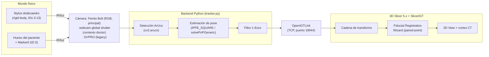
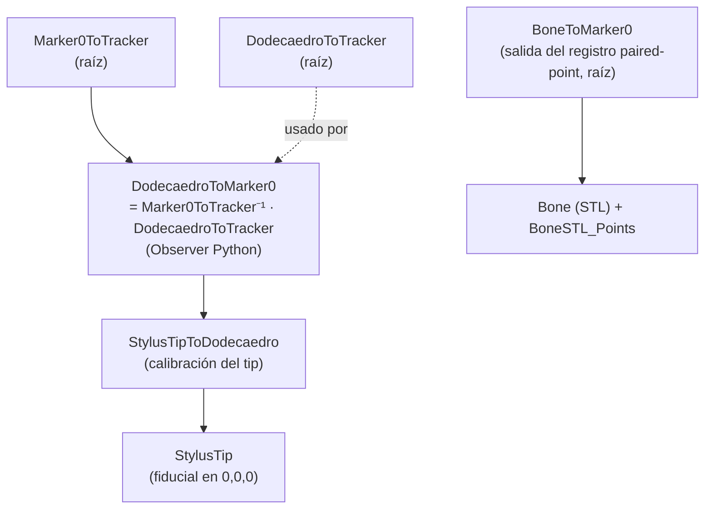

# ARCHITECTURE.md — Sistema de Navegación Quirúrgica (PoyectoNavegacion)

> **Qué es este documento (MVD 1 de 3):** describe **el sistema tal como es** hoy —
> topología, componentes, flujo de datos y convenciones. Es un documento **vivo**:
> se lee ANTES de tocar código y se actualiza cuando la arquitectura cambia.
> El *porqué* de las decisiones vive en `DECISIONS.md`; las *reglas y el estado
> operativo* viven en `CONTEXT.md`.
>
> _Última actualización: 2026-08-13. Estado: retomando tras pausa; vía activa =
> tracking óptico + registro **paired-point**. La rama de nube de puntos / Femto
> depth está **en stand by** (ver `CONTEXT.md` y `DECISIONS.md`)._

---

## 1. Propósito del sistema

Sistema de **navegación quirúrgica óptica** para cirugía ortopédica de columna
(vértebras L1–L5 + sacro). Trackea, con marcadores ArUco y una cámara, dos cosas
en el mismo espacio: un **instrumento** (stylus/puntero) y la **anatomía del
paciente** (un marcador de referencia pegado al hueso). Luego visualiza en **3D
Slicer** la coherencia espacial: un modelo 3D del hueso segmentado del CT del
paciente se alinea con el hueso físico, y al mover el stylus se ve en tiempo real
dónde está su punta respecto al modelo y a los cortes tomográficos.

Referencia visual del objetivo: demo de PerkLab (https://youtu.be/MOqh6wgOOYs).
Sistemas análogos comerciales: Brainlab, Navident, Medtronic StealthStation.

## 2. Topología (vista de alto nivel)



**Flujo en una frase:** la cámara ve los marcadores → el backend Python detecta y
estima poses → las envía por OpenIGTLink como transforms → 3D Slicer las encadena,
resuelve el registro paciente↔modelo y dibuja la punta del stylus sobre la
anatomía.

## 3. Componentes

### 3.1 Cámara (sensor de entrada)

El backend `webcam | femtobolt` se elige con `camera.camera_type`
(`camera_backend.py::create_backend`). Hay **dos cámaras en uso, en contextos
distintos**, más una legacy:

- **`femtobolt` — Orbbec Femto Bolt** (RGB 1920×1080; también ToF depth 640×576),
  vía `pyorbbecsdk` (paquete `pyorbbecsdk2`). Intrínsecos de fábrica del SDK.
  **Cámara principal / config canónica `tracker_config.yaml`** (contexto BigDaddy,
  Marker0 80 mm). Se usa **solo su RGB**: la rama de *depth* / nube de puntos está
  **en stand by**.
- **`webcam` global shutter — contexto "doctor"** (`tracker_config_doctor.yaml`,
  `source: 1`, intrínsecos `data/globalshutter.yml` @ 640×480, Marker0 60 mm).
  Sensor **global shutter** (sin skew de rolling shutter cuando el objeto se
  mueve). Es la cámara que maneja hoy el runbook
  `documentos/MANUAL_simplificado.md`. Reemplazó a la SVPRO en ese path (ADR-016).
- **`webcam` SVPRO** (AR0234, rolling shutter) — legacy de iter 1–3. Backend
  **MSMF** + códec **MJPG** obligatorio (si no, FPS ~5). Intrínsecos estilo MRPT.

> Las dos cámaras activas (Femto y global shutter) **conviven en contextos
> distintos**; no es un conflicto. La geometría del dodecaedro v2 es
> cámara-independiente (propiedad física), así que se comparte entre ambos
> contextos. `min_markers: 3`, `send_video: false` y el filtro 1-Euro son iguales
> en las dos configs.

### 3.2 Backend de tracking (`codigo/iter4/`)

`tracker.py` es el proceso principal. Por frame:

1. Adquiere imagen del backend de cámara (`camera_backend.py`).
2. Detecta marcadores ArUco (`cv2.aruco`, diccionario **DICT_ARUCO_MIP_36h12**,
   parámetros de detector tuneados para ángulos rasantes).
3. Estima poses: **IPPE_SQUARE** (o `solvePnPGeneric`) para marcadores
   individuales; para el rigid body multi-marcador (≥2 caras), resuelve la pose del
   cúmulo con las esquinas visibles vía **`SOLVEPNP_ITERATIVE` + refinamiento LM y
   rechazo de outliers**. Filtro `tvec[z] ≤ 0` para eliminar la ambigüedad planar.
4. Suaviza posición con **filtro 1-Euro** (`filtering` en el config).
5. Publica transforms por OpenIGTLink.

### 3.3 Cuerpos rígidos rastreados

- **Dodecaedro (stylus)** — cúmulo de marcadores multi-cara sobre un dodecaedro
  impreso. Versión vigente = **"v2 compartido", IDs 3–13**, lado de marcador
  **14.6 mm**, geometría en `data/reference_dodecaedro_v2_calibrado.txt`
  (calibrada por *bundle adjustment*, validada a 1.26 px de reproyección). El
  tracker publica `DodecaedroToTracker`.
- **Marker0 (referencia del paciente)** — un solo ArUco **ID 0**, pegado a la base
  del hueso. Tamaño **según contexto**: **80 mm** en la config Femto
  (`tracker_config.yaml`), **60 mm** en la config doctor/global-shutter
  (`tracker_config_doctor.yaml`). El tracker publica `Marker0ToTracker`.

### 3.4 Artefactos de calibración (entradas al sistema)

| Artefacto | Archivo(s) | Qué fija |
|---|---|---|
| Intrínsecos de cámara | `data/camera_calibration_webcam.yml` (webcam) / fábrica SDK (Femto) | matriz K + distorsión |
| Geometría del rigid body | `data/reference_dodecaedro_v2_calibrado.txt` | posición 3D de cada marcador en el frame del dodecaedro |
| Calibración de la punta | `data/StylusTipToDodecaedro_*.npy` (+`.txt`, `.h5`) | offset de la punta en el frame del dodecaedro |

> **Calibración de punta vigente:** `data/StylusTipToDodecaedro_femto_dock.npy`
> (corresponde a la geometría v2, magnitud ~201.8 mm, spread ~1.8 mm). Se usa
> **esta** por ahora (decidido 2026-08-13).
>
> **Acople crítico:** geometría del rigid body y calibración de la punta son del
> **mismo ensamble físico**. No se mezclan geometrías (ver `DECISIONS.md` y
> `CONTEXT.md`).

### 3.5 Transporte — OpenIGTLink

`pyigtl` sobre TCP, **puerto 18944**. Solo transforms (`send_video: false`; enviar
video satura el pipeline). El tracker **se bloquea si Slicer no está conectado**:
Slicer se conecta ANTES de arrancar el tracker.

### 3.6 Aplicación — 3D Slicer + SlicerIGT

Visualización y registro. Recibe los transforms por el módulo **OpenIGTLink IF**,
arma la cadena de transforms (§4), corre el **Fiducial Registration Wizard**
(paired-point) para alinear modelo↔paciente, y opcionalmente conduce los cortes
del CT con el **Volume Reslice Driver**. El procedimiento paso a paso está en
`documentos/MANUAL_simplificado.md`.

## 4. Flujo de datos y cadena de transforms en Slicer

El tracker emite dos transforms crudos (frame del tracker/cámara):
`Marker0ToTracker` y `DodecaedroToTracker`. Slicer construye el resto:



Puntos clave de la cadena (validados en iteraciones previas):

- **`DodecaedroToMarker0`** se calcula con un **Observer Python**, NO con el
  Transform Processor (este último a veces deja de actualizarse). Fórmula:
  `Marker0ToTracker⁻¹ · DodecaedroToTracker`.
- **`BoneToMarker0`** (salida del registro) queda en la **raíz**, al mismo nivel
  que `Marker0ToTracker` y `DodecaedroToTracker`. El modelo **`Bone`** y
  **`BoneSTL_Points`** son **hijos** de `BoneToMarker0` (ambos; si solo se anida
  el modelo, los puntos quedan descolocados).
- **`Physical_Points`** (puntos tocados con el stylus) se queda en la raíz.

## 5. Registro paciente ↔ modelo (paired-point)

Método activo: **paired-point** con el Fiducial Registration Wizard.

1. Se marcan 6–9 puntos sobre el STL (`BoneSTL_Points`) en features reconocibles.
2. Se tocan los mismos features, en el mismo orden, con la punta del stylus →
   `Physical_Points`.
3. El wizard calcula la transform rígida `BoneToMarker0` y reporta el **RMS**.
4. Criterio: RMS < 1.5 mm excelente, 1.5–3 mm aceptable, > 5 mm hay error.

Métrica histórica de referencia: RMS **3.46 mm** (iter 1) → **2.80 mm** (iter 3).

## 6. Estructura del repositorio (verificada 2026-08-13)

```
C:\Dev\Dr.Milton\PoyectoNavegacion\
├── CLAUDE.md, PROJECT_BRIEF.md
├── ARCHITECTURE.md  DECISIONS.md  CONTEXT.md   # ← los 3 MVD (nuevos)
├── codigo\
│   ├── .venv\                      # Python 3.11.9
│   ├── requirements.txt, readme.md
│   ├── iter4\                      # ← CÓDIGO ACTIVO
│   │   ├── tracker.py                          # tracker principal
│   │   ├── camera_backend.py                   # webcam | femtobolt
│   │   ├── tracker_config.yaml                 # config Femto (default)
│   │   ├── tracker_config_doctor.yaml          # config webcam (paired-point)
│   │   ├── tracker_config_webcam.yaml, *_stylus_impreso.yaml
│   │   ├── captura_calibracion.py              # dataset para BA
│   │   ├── calibrar_rigid_body.py              # bundle adjustment
│   │   ├── calibrar_tip_divot.py               # calibración por dock/divot
│   │   ├── identificar_ids.py                  # verificar IDs/orientación
│   │   ├── test_*.py                           # diagnósticos
│   │   └── data\                               # reference_*, capturas, tips, calibraciones
│   └── historico\                  # snapshots de iteraciones previas
├── femto_pruebas\                  # rama nube de puntos (EN STAND BY)
├── stl\                            # dodecaedro, placas dock/divot, BaseMarcador, STL del hueso
├── herramientas\                   # pivotes/offsets legacy (.h5)
└── documentos\
    ├── MANUAL_simplificado.md      # runbook operativo del doctor (autoritativo)
    ├── MANUAL_webcam.md, MANUAL_femtobolt.md
    └── ...
```

> **Nota de reestructuración:** el código de tracking se movió de `codigo\` (raíz)
> a `codigo\iter4\`, y la raíz del proyecto es `C:\Dev\Dr.Milton\PoyectoNavegacion`
> (antes `C:\Dev\PoyectoNavegacion`). El `CLAUDE.md` todavía tiene las rutas viejas
> (pendiente de actualizar).

## 7. Frames de coordenadas y convenciones

- **Frame del tracker** = frame de la cámara. Todo lo crudo del tracker vive ahí.
- **Frame del dodecaedro** = frame del rigid body del stylus (origen ~centro del
  dodecaedro). La calibración de la punta se expresa aquí.
- **Frame de Marker0** = frame del paciente. El registro deja el hueso aquí.
- **Convención de esquinas del marcador:** `c0=TL c1=TR c2=BR c3=BL`.
- **LPS↔RAS:** Slicer carga STL con conversión LPS→RAS (voltea X,Y). Relevante
  cuando una transform se calcula sobre vértices crudos fuera de Slicer (era el
  caso de la rama por superficie; en paired-point el wizard maneja el frame).

## 8. Decisiones de configuración (confirmadas 2026-08-13)

1. **Cámara principal = Femto Bolt** (solo RGB), config canónica
   `tracker_config.yaml`. En **paralelo**, el contexto "doctor" usa una webcam
   **global shutter** (`tracker_config_doctor.yaml`, ADR-016). Ambas conviven.
2. **Marker0 del paciente = 80 mm** en el contexto Femto (60 mm en el contexto
   doctor).
3. **Calibración de la punta = usar la existente**
   `StylusTipToDodecaedro_femto_dock` (dodecaedro v2, ~1.8 mm de spread), sin
   recalibrar por ahora.

### Duda menor aún abierta

- **Dos equipos/ensambles:** memoria registra un "equipo del doctor" en máquina
  aparte (marker 16.58 mm). Este documento describe la máquina **BigDaddy** con el
  dodecaedro **v2 (IDs 3–13)**; si el otro equipo sigue vivo, se documenta aparte.
  (Confirmar cuando aplique — no bloquea.)
```
