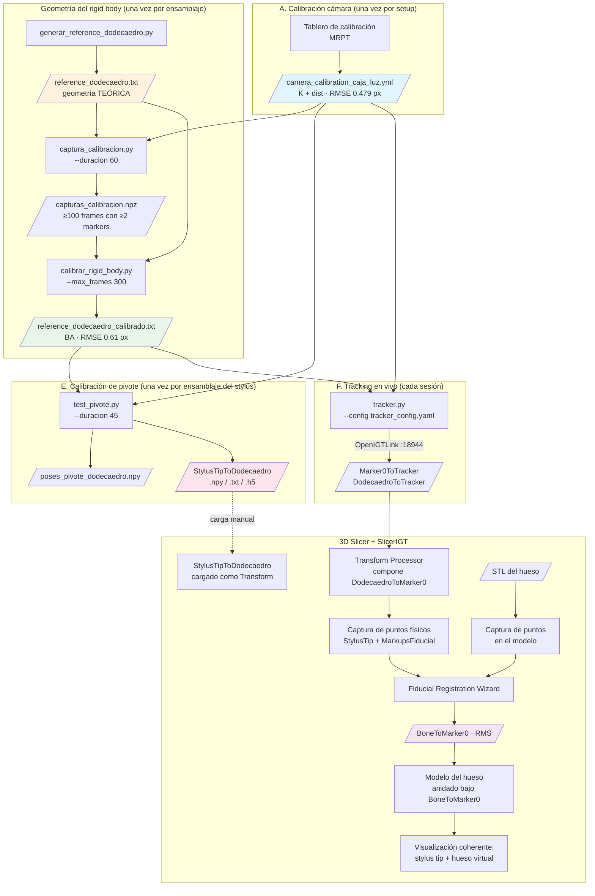

# 01 — Mapa del flujo end-to-end

**Fase 1 de la auditoría de iteración 2.**

Este documento describe el pipeline completo del sistema de navegación quirúrgica, desde el hardware físico hasta la visualización en 3D Slicer. Es el esqueleto sobre el que se construirá la guía "Reproducir desde cero" y la base contra la cual se auditarán los scripts en fases posteriores.

Convenciones del documento:
- **Etapa** = paso del flujo. Algunas se ejecutan una sola vez por configuración, otras una vez por sesión, otras en vivo.
- **Artefacto** = archivo concreto (calibración, geometría, transformada, pose, etc.) que entra o sale de una etapa.
- **Frecuencia**: cuándo hay que volver a correr la etapa.

---

## 1. Visión general

El sistema rastrea con una webcam dos cuerpos rígidos:

1. Un **marker 0** (ArUco de 60.8 mm pegado a la base del hueso phantom).
2. Un **dodecaedro multi-marker** (11 marcadores DICT_ARUCO_MIP_36h12 de 16 mm, IDs 151–161 en iter 1) montado sobre un stylus con punta esférica.

Cada cuerpo entrega su pose en frame de cámara por OpenIGTLink (puerto 18944) a 3D Slicer. Allí se hace registro paired-point entre el modelo STL del hueso y puntos físicos tocados con la punta del stylus. El resultado final es que el modelo virtual del hueso aparece superpuesto/coherente con el hueso real, y al mover el stylus se ve su punta en posición correcta respecto al modelo.

Hay tres cosas que el sistema debe medir/calibrar **antes** de poder navegar:

- **Calibración intrínseca de la cámara** (`K`, `dist`).
- **Geometría real del dodecaedro** (`reference_dodecaedro_calibrado.txt`) — corrige errores de impresión y pegado.
- **Offset de la punta** respecto al centro del dodecaedro (`StylusTipToDodecaedro`) — calibración de pivote.

Y dos cosas que se hacen **al inicio de cada sesión clínica**:

- **Registro paired-point** entre el modelo STL y el hueso físico (matriz `BoneToMarker0` en Slicer).
- **Conexión OpenIGTLink** Tracker ↔ Slicer.

---

## 2. Pre-requisitos físicos (estado del hardware antes de empezar)

Estas son condiciones que el flujo asume cumplidas. Si alguna cambia, hay que volver a la etapa correspondiente.

| Pre-requisito | Si cambia, re-ejecutar |
|---|---|
| Cámara SVPRO AR0234 montada y enfocada, dentro de la caja de luz Puluz | Etapa A — calibración intrínseca |
| Lentes/foco/exposición de la cámara fijos | Etapa A |
| Dodecaedro 377% impreso, 11 marcadores pegados según convención (ID label apuntando hacia la punta, ID 152 e ID 157 comparten arista) | Etapas B y D |
| Stylus ensamblado (dodecaedro + barra + punta esférica), tornillos apretados | Etapa E |
| Marker 0 (ID 0, 60.8 mm) pegado a la base del hueso phantom, sin moverse desde el escaneo del STL | Etapa H (registro) |
| Modelo STL del hueso phantom disponible | — |
| Iluminación uniforme de la caja de luz, sin reflejos sobre los marcadores | Re-captura |

---

## 3. Diagrama del pipeline

---

## 4. Detalle por etapa

A continuación, cada nodo del flujo con: propósito, entradas, salidas, supuestos críticos y métrica esperada. Los nombres de archivo son los reales en `codigo/` y `codigo/data/`.

### Etapa A — Calibración intrínseca de la cámara

| Campo | Valor |
|---|---|
| Propósito | Obtener `K` (matriz intrínseca) y `dist` (coeficientes de distorsión radial/tangencial) de la cámara. |
| Script | **No vive en este repo**. Se hizo con MRPT externamente. |
| Inputs | Capturas del tablero de calibración a 1280×960 dentro de la caja de luz. |
| Outputs | `codigo/data/camera_calibration_caja_luz.yml` (`K` 3×3 + `dist` 1×5, formato OpenCV YAML). |
| Frecuencia | Una vez por configuración óptica de la cámara. Si la cámara se mueve, refoca o cambia de zoom, recalibrar. |
| Supuestos | El sistema opera a 640×480 pero la calibración se hizo a 1280×960 y se escala. `K` ya viene guardado para 640×480 (cx ≈ 315, cy ≈ 237, fx ≈ fy ≈ 427). |
| Métrica esperada | RMSE de reproyección sobre el patrón: 0.479 px (lo logrado en iter 1). |
| Consumido por | C, D, E, F (todas las etapas que usan visión). |

### Etapa B — Generación de la geometría teórica del dodecaedro

| Campo | Valor |
|---|---|
| Propósito | Producir el archivo de geometría 3D inicial del dodecaedro suponiendo impresión y pegado perfectos. Es la **semilla** del bundle adjustment. |
| Script | `codigo/generar_reference_dodecaedro.py` (iter 1, IDs 151–161). **⚠ Hallazgo de verificación (2026-05-14): este script NO está en el repo actual.** Sólo existe su output (`reference_dodecaedro.txt`). Es un riesgo de reproducibilidad — la geometría teórica no se puede regenerar desde cero sin recuperar/recrear el script. Ver §6 punto 8. |
| Inputs | Parámetros geométricos hard-codeados: arista 20 mm, marcador 16 mm, escala 377 %, asignación de IDs por cara (TOP=151, banda superior 152–156 CCW, banda inferior 157–161 CCW). |
| Outputs | `codigo/data/reference_dodecaedro.txt`. Una línea por marcador con: `tag_id  cx cy cz  c0x c0y c0z  c1x c1y c1z  c2x c2y c2z  c3x c3y c3z` (centro + 4 esquinas). Convención de esquinas: c0 top-left, c1 top-right, c2 bottom-right, c3 bottom-left, **ID label apuntando hacia la punta**. |
| Frecuencia | Una vez por convención de pegado. Si los IDs cambian (iter 1 → iter 2: 1–11), regenerar. |
| Supuestos críticos | • Cara BASE no lleva marcador (la oculta el tornillo). • ID 152 y ID 157 comparten arista (validación física). • Origen del sistema = centro geométrico del dodecaedro. • Eje +Z apunta a la cara TOP (ID 151). |
| Consumido por | C (sólo lee los IDs), D (semilla del BA), E (sólo si no hay calibrado todavía). |

### Etapa C — Captura del dataset multi-marker

| Campo | Valor |
|---|---|
| Propósito | Capturar entre 100 y 2000 frames con detecciones 2D de los marcadores del dodecaedro en distintas orientaciones. Es la materia prima para el bundle adjustment. |
| Script | `codigo/captura_calibracion.py --duracion 60 --output capturas_calibracion.npz` |
| Inputs | `tracker_config.yaml` (config de cámara, diccionario, IDs del rigid body por lectura del reference) + `camera_calibration_caja_luz.yml`. |
| Outputs | `codigo/capturas_calibracion.npz` con `frames_data` (lista de dicts `{timestamp, detecciones: {tag_id → corners 4×2}}`), `K`, `dist`, `rb_ids`. Sólo se guardan frames con ≥2 marcadores detectados. |
| Frecuencia | Una vez por ensamblaje físico del dodecaedro. |
| Supuestos críticos | • Rotación lenta cubriendo todas las caras. • Distancia 30–50 cm de la cámara. • Iluminación uniforme. • Subpíxel CORNER_REFINE_SUBPIX activado. |
| Métrica esperada | ≥100 frames útiles (iter 1: ~1760). Cobertura: cada par de marcadores observado al menos varias veces. |
| Consumido por | D. |

### Etapa D — Bundle adjustment del rigid body

| Campo | Valor |
|---|---|
| Propósito | Resolver simultáneamente (a) las posiciones 3D reales de los 11 marcadores en el frame del dodecaedro, y (b) la pose del dodecaedro en cada frame del dataset. Minimiza error de reproyección 2D global. |
| Script | `codigo/calibrar_rigid_body.py --input capturas_calibracion.npz --teorico data/reference_dodecaedro.txt --output data/reference_dodecaedro_calibrado.txt --max_frames 300` |
| Inputs | `capturas_calibracion.npz`, `reference_dodecaedro.txt` (semilla), implícitamente `K` y `dist` (vienen dentro del .npz). |
| Outputs | `codigo/data/reference_dodecaedro_calibrado.txt` (mismo formato que el teórico). |
| Frecuencia | Una vez por ensamblaje físico. |
| Supuestos críticos | • **Marcador ancla ID 151 fijo en su posición teórica** — esto define el sistema de coordenadas (gauge fixing): origen, escala y orientación quedan fijados por el ancla. Si el ancla está mal pegada en la cara TOP, todo el frame queda inclinado. • Loss `huber` con `f_scale=2.0` (robusto a outliers). • Método `trf` (trust region reflective), `max_nfev=200`. • Submuestreo uniforme a `max_frames`. |
| Métrica esperada | RMSE de reproyección final: ≤1 px (iter 1: 0.61 px, reducción 94 % vs teórico). Desplazamiento típico por marcador: 0.5–3 mm respecto al teórico. |
| Consumido por | E, F, y cualquier captura futura. **Importante: a partir de aquí, todos los scripts deben apuntar a `reference_dodecaedro_calibrado.txt`, no al teórico** (regla del proyecto). |

### Etapa E — Calibración de pivote (offset de la punta)

**Pieza crítica del proyecto.** Reemplaza la calibración de pivote de PlusServer. Es la que más necesita auditoría matemática.

| Campo | Valor |
|---|---|
| Propósito | Determinar la posición de la punta del stylus en el frame del dodecaedro: `StylusTipToDodecaedro` (matriz 4×4 con traslación, rotación identidad). |
| Script | `codigo/test_pivote.py --duracion 45` |
| Inputs | `tracker_config.yaml` + `camera_calibration_caja_luz.yml` + `reference_dodecaedro_calibrado.txt`. Físicamente: punta del stylus clavada en un cartón con orificio, movimiento de cono manteniendo punta fija. |
| Outputs | • `poses_pivote_dodecaedro.npy` (matrices 4×4 de `DodecaedroToCamara`, una por frame válido).  • `StylusTipToDodecaedro.npy` (matriz 4×4, traslación = offset). • `StylusTipToDodecaedro.txt` (con metadata: offset, std, RMSE). • **`StylusTipToDodecaedro.h5` NO lo genera este script.** El `.h5` se produce desde Slicer manualmente (cargar la matriz como Linear Transform y guardarla). Existe sólo en `final/`. Documentar o automatizar este paso. |
| Frecuencia | Una vez por ensamblaje del stylus. Si se desensambla/reensambla, recalibrar. |
| Algoritmo (resumen, **a auditar en Fase 3.4**) | 1. Capturar `N` poses (cuaternión-tvec) del dodecaedro durante el pivote. 2. Extraer las posiciones `t_i = pose_i[:3,3]` (centro del dodecaedro en cada frame, en frame de cámara). 3. RANSAC sobre ajuste a esfera: 1000 iter, sample_size=20, umbral_inlier=1.5 mm. 4. Ajuste least-squares de esfera a los inliers → centro `c_pivot` (la posición del pivote en frame de cámara) y radio `r` (≈ distancia centro_dodecaedro–punta). 5. Para cada pose inlier: transformar `c_pivot` al frame del dodecaedro: `tip_d_i = pose_i^{-1} · c_pivot`. 6. Offset final = promedio de `tip_d_i`. Std = desviación entre ellos. |
| Métrica esperada | Std del offset por eje < 2 mm (iter 1: [1.68, 1.45, 0.38] mm), magnitud del offset ≈ 88 mm en –Z (iter 1: −88.6 mm). |
| Consumido por | Slicer (transformada cargada al inicio de cada sesión). |
| Riesgos conocidos | • La rotación del offset se asume identidad — esto es correcto sólo si "StylusTip" se interpreta como punto, no como frame con orientación. Para Slicer + StylusTip MarkupsFiducial en (0,0,0) es OK; si en el futuro queremos un frame con eje del stylus, hay que cambiarlo. • El método RANSAC + esfera asume punta esférica (cumplido). Para punta cónica habría que cambiar el modelo. |

### Etapa F — Tracking en vivo

| Campo | Valor |
|---|---|
| Propósito | Detectar todos los marcadores en cada frame, computar `Marker0ToTracker` y `DodecaedroToTracker`, y enviarlas por OpenIGTLink a Slicer. |
| Script | `codigo/tracker.py --config tracker_config.yaml` |
| Inputs | `tracker_config.yaml`, `camera_calibration_caja_luz.yml`, `reference_dodecaedro_calibrado.txt`. |
| Outputs | Flujo de mensajes `TransformMessage` por OpenIGTLink en puerto 18944: • `Marker0ToTracker` (cuando ID 0 visible) — pose por IPPE_SQUARE. • `DodecaedroToTracker` (cuando ≥1 marker del rigid body visible) — pose por IPPE_SQUARE si N=1, ITERATIVE+LM si N≥2. |
| Frecuencia | Una vez por sesión (corre todo el tiempo durante navegación). |
| Supuestos críticos | • Backend MSMF + FOURCC MJPG (sin esto cae a 5 FPS). • `send_video: false` (sino satura). • Filtrado 1-Euro desactivado por defecto. • La pose multi-marker concatena puntos 3D-2D de todos los markers visibles del rigid body y resuelve un solo PnP. |
| Métrica esperada | 28–30 FPS sostenidos, 3–4 markers/frame promedio. |
| Consumido por | Slicer (cliente TCP). |

### Etapa G — Composición en Slicer: DodecaedroToMarker0

| Campo | Valor |
|---|---|
| Propósito | Llevar el dodecaedro al frame del paciente (marker 0). Es necesario porque Fiducial Registration Wizard ignora transformadas padre al leer coordenadas. |
| Script | No es código nuestro: módulo **Transform Processor** de SlicerIGT, configurado para computar `DodecaedroToMarker0 = inv(Marker0ToTracker) · DodecaedroToTracker`. |
| Inputs | Las dos transformadas que llegan por OpenIGTLink. |
| Outputs | `DodecaedroToMarker0` (transformada calculada en Slicer). |
| Supuestos críticos | • Configuración exacta de Transform Processor (input, inverse, output) según skill `slicer-igt-workflow`. • Marker 0 debe estar visible para que la composición tenga sentido. |

### Etapa H — Registro paired-point

| Campo | Valor |
|---|---|
| Propósito | Calcular `BoneToMarker0`: la transformada que pone el modelo STL en el frame del paciente. |
| Script | No es código nuestro: **Fiducial Registration Wizard** de SlicerIGT. |
| Inputs | • `BoneSTL_Points` (markups en el modelo STL, capturados manualmente en Slicer sobre features identificables del hueso). • `Physical_Points` (markups capturados tocando con la punta del stylus los mismos features físicos — la punta está disponible gracias a `StylusTipToDodecaedro`). • Modo: **rigid** (sin escala). • Ambos sets deben tener correspondencia 1-a-1 (mismo orden). |
| Outputs | `BoneToMarker0` (matriz 4×4) + métrica **RMS** del registro. |
| Métrica esperada | RMS ≤ 3.46 mm (iter 1). Objetivo iter 2: ≤2 mm. |
| Supuestos críticos | • Marker 0 no se ha movido entre captura de puntos físicos y visualización. • La punta esférica toca los features de forma consistente (un punto físico ambiguo arruina el RMS — ver "Outlier point" en el skill). |

### Etapa I — Visualización coherente

| Campo | Valor |
|---|---|
| Propósito | Mostrar el modelo del hueso en el sitio físico correcto, y la punta del stylus moviéndose en tiempo real respecto al modelo. |
| Script | Configuración manual de la jerarquía en Slicer (sin código). |
| Jerarquía requerida | • **Bone** (modelo STL) → padre `BoneToMarker0`. • **BoneSTL_Points** → padre `BoneToMarker0` *(crítico — si no, los puntos del modelo no se mueven con él)*. • **StylusTip** (MarkupsFiducial en (0,0,0)) → padre `StylusTipToDodecaedro` → padre `DodecaedroToMarker0`. • Locator models del dodecaedro y marker 0 anidados igual para visualización. |
| Frecuencia | Una vez por sesión (queda guardada en el .mrml). |

---

## 5. Tabla resumen de artefactos

| Artefacto | Producido por | Consumido por | Frecuencia |
|---|---|---|---|
| `camera_calibration_caja_luz.yml` | MRPT (externo) | C, D, E, F | Por setup de cámara |
| `reference_dodecaedro.txt` | B | D | Por convención de IDs |
| `capturas_calibracion.npz` | C | D | Por ensamblaje |
| `reference_dodecaedro_calibrado.txt` | D | E, F | Por ensamblaje |
| `poses_pivote_dodecaedro.npy` | E | (re-análisis) | Por ensamblaje stylus |
| `StylusTipToDodecaedro.npy/.txt/.h5` | E | Slicer | Por ensamblaje stylus |
| `tracker_config.yaml` | manual | C, E, F | Por configuración |
| Stream `Marker0ToTracker` | F | Slicer | En vivo |
| Stream `DodecaedroToTracker` | F | Slicer (→ G) | En vivo |
| `DodecaedroToMarker0` | G (Transform Processor) | H, I | En vivo |
| `BoneSTL_Points.mrk.json` | manual en Slicer | H | Por modelo STL |
| `Physical_Points.mrk.json` | manual con stylus | H | Por sesión |
| `BoneToMarker0.h5` | H | I | Por sesión |
| `*.mrml` | Slicer | (persistencia) | Por sesión |

---

## 6. Áreas de riesgo identificadas (alimentan las fases siguientes)

De la lectura del código, ya saltan estas zonas que merecen escrutinio cuando lleguemos a Fase 3 (auditoría) y Fase 4 (validación cuantitativa):

1. **Calibración de pivote — `test_pivote.py` (Fase 3.4, máxima prioridad).**
   - Reemplaza directamente a PlusServer. Es la pieza con menos certeza.
   - Punto a auditar: la matemática del paso 5 (transformar centro del pivote al frame del dodecaedro). Verificar contra la formulación clásica de Yaniv 2015 / la que usa PlusServer (Two-step pivot calibration o cuadrática unificada).
   - RANSAC + ajuste de esfera es un enfoque válido pero diferente al "AX = b" canónico. Hay que compararlos numéricamente con datos sintéticos.

2. **Bundle adjustment — anclaje del marcador 151.**
   - Es la única restricción de gauge. Si el marker 151 está pegado torcido en la cara TOP, **todo el frame del dodecaedro queda torcido**, y eso propaga a pivote y registro.
   - Mitigación posible: anclar 2 marcadores (uno fija origen, otro fija orientación) en vez de uno.

3. **Código duplicado entre `tracker.py` y `test_pivote.py`.**
   - `cargar_calibracion`, `cargar_rigid_body`, `estimar_pose_rigid_body`, `rvec_tvec_a_matriz` están duplicados. Riesgo de divergencia entre el algoritmo "online" y el de calibración. Candidato a extraer a un módulo común durante la fase de mejoras.

4. **Detección PnP con N=1 marcador.**
   - El tracker permite trackear el dodecaedro con un solo marcador visible (cae a IPPE_SQUARE). Esto es válido pero **introduce ambigüedad planar potencial** justo cuando hay menos información. Decidir si quiere mantenerse, o requerir N≥2.

5. **Ausencia de tests automatizados.**
   - Ninguna de las piezas matemáticas tiene tests con datos sintéticos. Para auditar correctness sin "tests visuales", la Fase 4 tendrá que construirlos.

6. **El archivo `StylusTipToDodecaedro.h5` no se genera desde `test_pivote.py`.**
   - El .npy y .txt sí; el .h5 (formato Slicer) requiere paso manual. Documentar el procedimiento exacto o automatizarlo.

7. **Convención de signo de Z en el offset del pivote.**
   - El offset actual es `[0.315, -0.258, -88.617]` mm. Z negativo es consistente con la convención "+Z apunta a TOP" del dodecaedro y la punta del lado opuesto. Verificar en Fase 3 que el signo es coherente con cómo Slicer interpreta la cadena de transformadas (lo del skill: "Z varía más que X-Y es normal" implica que sí lo es, pero confirmarlo numéricamente).

8. **`generar_reference_dodecaedro.py` no está en el repo.**
   - El skill lo lista como artefacto histórico de iter 1, pero el archivo físico no existe en `codigo/`. Sólo existe su output (`reference_dodecaedro.txt`). Riesgo de reproducibilidad: la geometría teórica no puede regenerarse desde cero sin recuperar el script o recrearlo.
   - Acción sugerida en Fase 5: recrear el script a partir de los parámetros conocidos (arista 20 mm, marcador 16 mm, escala 377 %, convención de pegado) y dejarlo versionado.

9. **`StylusTipToDodecaedro.h5` requiere paso manual en Slicer.**
   - `test_pivote.py` produce `.npy` y `.txt`. El `.h5` (formato Slicer) sólo aparece en `final/`, generado a mano cargando el `.npy` en Slicer y guardando la escena. Riesgo: si se omite o se carga la matriz equivocada, falla silenciosamente y no se nota hasta el registro.
   - Acción sugerida: o se automatiza la escritura del `.h5` desde Python (h5py + formato Slicer), o se documenta el procedimiento manual en la guía "Reproducir desde cero".

---

## 7. Próximos pasos

- **Fase 2 — Inventario de artefactos**: tabla exhaustiva de cada archivo en `codigo/`, `codigo/data/` y `final/`: quién lo produjo, con qué inputs y en qué fecha. Detectar archivos huérfanos, duplicados o de iteraciones viejas.
- **Fase 3 — Auditoría por script**, en orden: `captura_calibracion.py` → `calibrar_rigid_body.py` → `tracker.py` → `test_pivote.py`.
- **Fase 4 — Validación cuantitativa**: tests con datos sintéticos para BA y pivote.
- **Fase 5 — Mejoras** (post auditoría).
- **Fase 6 — Documento maestro "Reproducir desde cero"** (consolidación final).
