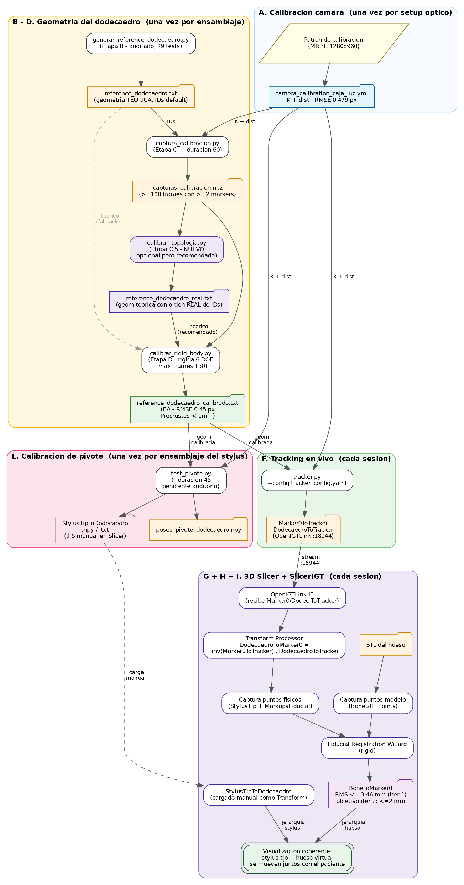
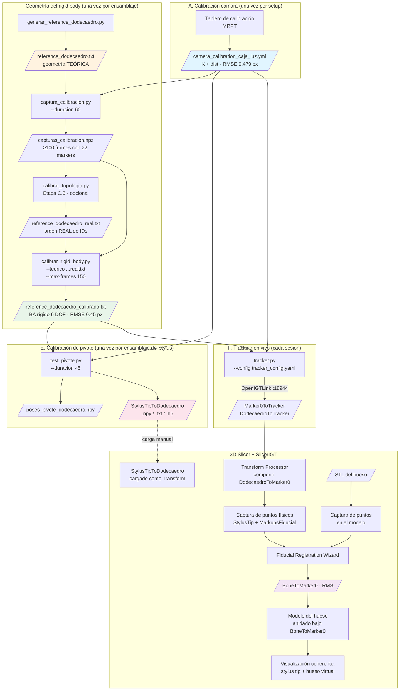

# 01 — Mapa del flujo end-to-end

**Fase 1 de la auditoría de iteración 2.**

Este documento describe el pipeline completo del sistema de navegación quirúrgica, desde el hardware físico hasta la visualización en 3D Slicer. Es el esqueleto sobre el que se construirá la guía "Reproducir desde cero" y la base contra la cual se auditarán los scripts en fases posteriores.

Convenciones del documento:
- **Etapa** = paso del flujo. Algunas se ejecutan una sola vez por configuración, otras una vez por sesión, otras en vivo.
- **Artefacto** = archivo concreto (calibración, geometría, transformada, pose, etc.) que entra o sale de una etapa.
- **Frecuencia**: cuándo hay que volver a correr la etapa.

---

## 1. Visión general

El sistema rastrea con una webcam dos cuerpos rígidos:

1. Un **marker 0** (ArUco de 60.8 mm pegado a la base del hueso phantom).
2. Un **dodecaedro multi-marker** (11 marcadores DICT_ARUCO_MIP_36h12 de 16 mm, IDs 151–161 en iter 1) montado sobre un stylus con punta esférica.

Cada cuerpo entrega su pose en frame de cámara por OpenIGTLink (puerto 18944) a 3D Slicer. Allí se hace registro paired-point entre el modelo STL del hueso y puntos físicos tocados con la punta del stylus. El resultado final es que el modelo virtual del hueso aparece superpuesto/coherente con el hueso real, y al mover el stylus se ve su punta en posición correcta respecto al modelo.

Hay cuatro cosas que el sistema debe medir/calibrar **antes** de poder navegar:

- **Calibración intrínseca de la cámara** (`K`, `dist`).
- **Topología real del dodecaedro** (`reference_dodecaedro_real.txt`) — detecta el orden físico real de los IDs en los anillos (porque el orden en que se pegaron físicamente los markers puede no coincidir con el orden teórico asumido). Etapa C.5, opcional pero **fuertemente recomendada**.
- **Geometría real del dodecaedro** (`reference_dodecaedro_calibrado.txt`) — corrige errores residuales de impresión y pegado.
- **Offset de la punta** respecto al centro del dodecaedro (`StylusTipToDodecaedro`) — calibración de pivote.

Y dos cosas que se hacen **al inicio de cada sesión clínica**:

- **Registro paired-point** entre el modelo STL y el hueso físico (matriz `BoneToMarker0` en Slicer).
- **Conexión OpenIGTLink** Tracker ↔ Slicer.

---

## 2. Pre-requisitos físicos (estado del hardware antes de empezar)

Estas son condiciones que el flujo asume cumplidas. Si alguna cambia, hay que volver a la etapa correspondiente.

| Pre-requisito | Si cambia, re-ejecutar |
|---|---|
| Cámara SVPRO AR0234 montada y enfocada, dentro de la caja de luz Puluz | Etapa A — calibración intrínseca |
| Lentes/foco/exposición de la cámara fijos | Etapa A |
| Dodecaedro 377% impreso, 11 marcadores pegados según convención (ID label apuntando hacia la punta, ID 152 e ID 157 comparten arista) | Etapas B y D |
| Stylus ensamblado (dodecaedro + barra + punta esférica), tornillos apretados | Etapa E |
| Marker 0 (ID 0, 60.8 mm) pegado a la base del hueso phantom, sin moverse desde el escaneo del STL | Etapa H (registro) |
| Modelo STL del hueso phantom disponible | — |
| Iluminación uniforme de la caja de luz, sin reflejos sobre los marcadores | Re-captura |

---

## 3. Diagrama del pipeline



*Versiones disponibles:* [`01_mapa_del_flujo.png`](01_mapa_del_flujo.png) (estándar) · [`01_mapa_del_flujo_HD.png`](01_mapa_del_flujo_HD.png) (alta resolución) · [`01_mapa_del_flujo.svg`](01_mapa_del_flujo.svg) (escalable). El fuente Mermaid está abajo por si se quiere regenerar.



---

## 4. Detalle por etapa

A continuación, cada nodo del flujo con: propósito, entradas, salidas, supuestos críticos y métrica esperada. Los nombres de archivo son los reales en `codigo/` y `codigo/data/`.

### Etapa A — Calibración intrínseca de la cámara

| Campo | Valor |
|---|---|
| Propósito | Obtener `K` (matriz intrínseca) y `dist` (coeficientes de distorsión radial/tangencial) de la cámara. |
| Script | **No vive en este repo**. Se hizo con MRPT externamente. |
| Inputs | Capturas del tablero de calibración a 1280×960 dentro de la caja de luz. |
| Outputs | `codigo/data/camera_calibration_caja_luz.yml` (`K` 3×3 + `dist` 1×5, formato OpenCV YAML). |
| Frecuencia | Una vez por configuración óptica de la cámara. Si la cámara se mueve, refoca o cambia de zoom, recalibrar. |
| Supuestos | El sistema opera a 640×480 pero la calibración se hizo a 1280×960 y se escala. `K` ya viene guardado para 640×480 (cx ≈ 315, cy ≈ 237, fx ≈ fy ≈ 427). |
| Métrica esperada | RMSE de reproyección sobre el patrón: 0.479 px (lo logrado en iter 1). |
| Consumido por | C, D, E, F (todas las etapas que usan visión). |

### Etapa B — Generación de la geometría teórica del dodecaedro

| Campo | Valor |
|---|---|
| Propósito | Producir el archivo de geometría 3D inicial del dodecaedro suponiendo impresión y pegado perfectos. Es la **semilla** del bundle adjustment. |
| Script | `codigo/generar_reference_dodecaedro.py` — **auditado y mejorado 2026-05-16** (ver `03a_auditoria_generar_reference_dodecaedro.md`). Parametrizado por CLI, con validación exhaustiva integrada y suite de tests pytest (29/29 PASS). |
| Inputs (CLI, con defaults iter 1) | `--edge-mm 20`, `--marker-mm 16`, `--id-top 151`, `--ids-superior 152,153,154,155,156`, `--ids-inferior 157,158,159,160,161`, `--output data/reference_dodecaedro.txt`. Para iter 2 con IDs 1-11, basta cambiar las flags `--id-top` y `--ids-*`. |
| Outputs | `codigo/data/reference_dodecaedro.txt`. Una línea por marcador con: `tag_id  cx cy cz  c0x c0y c0z  c1x c1y c1z  c2x c2y c2z  c3x c3y c3z`. Convención: c0=TL, c1=TR, c2=BR, c3=BL (OpenCV ArUco clockwise desde top-left). **ID label apunta hacia +Z** (regla "hacia la punta"). El header del archivo documenta todo. |
| Validación integrada | Antes de guardar, corre 11 chequeos: identidades matemáticas (PHI, THETA, inradius por dos fórmulas), invariantes geométricos (equidistancia, simetría de normales, adyacencias TOP-cinturón y antiprismática), marker fit en cara, esquinas cuadradas de lado `marker_mm`. Si algún chequeo falla, sale con `SystemExit` sin guardar. |
| Tests | `codigo/tests/test_generar_reference_dodecaedro.py` (29 tests). Ejecutar con `python -m pytest tests/ -v`. Incluye test de reproducibilidad bit-a-bit contra `historico/iter1_2026-05-16/data/reference_dodecaedro.txt` y test de migración a IDs 1-11. |
| Frecuencia | Una vez por convención de IDs/dimensiones. Si los IDs cambian (iter 1 → iter 2: 1–11), regenerar con las flags CLI. |
| Supuestos críticos | • Cara BASE no lleva marcador (la oculta el tornillo). • Cada `ID_SUPERIOR[i]` e `ID_INFERIOR[i]` comparten arista (validación física). • Origen del sistema = centro geométrico del dodecaedro. • Eje +Z apunta a la cara TOP. |
| Comando típico (iter 1) | `python generar_reference_dodecaedro.py` |
| Comando típico (iter 2, IDs 1-11) | `python generar_reference_dodecaedro.py --id-top 1 --ids-superior 2,3,4,5,6 --ids-inferior 7,8,9,10,11` |
| Consumido por | C (sólo lee los IDs), D (semilla del BA), E (sólo si no hay calibrado todavía). |

#### Operación paso a paso (Etapa B)

**Naturaleza del script:** cálculo matemático puro. **No abre ventana, no usa cámara, no hace captura.** Solo computa la geometría teórica del dodecaedro regular a partir de las fórmulas canónicas y la guarda en un archivo de texto.

**1) Prerrequisitos antes de correr**

- Venv activado: `cd C:\Dev\Dr.Milton\PoyectoNavegacion\codigo` → `.\.venv\Scripts\activate`.
- Dependencias del script: `numpy`, `scipy` (ya vienen en el venv). Para correr los tests además: `pytest`.
- Si `pip install` falla con "Unable to create process" en Windows, usar `python -m pip install pytest` (el launcher `pip.exe` del venv puede haber quedado con paths viejos si la carpeta del proyecto se renombró).

**2) Comando**

Iteración 1 (default, IDs 151-161):
```powershell
python generar_reference_dodecaedro.py
```

Iteración 2 (IDs 1-11):
```powershell
python generar_reference_dodecaedro.py `
    --id-top 1 --ids-superior 2,3,4,5,6 --ids-inferior 7,8,9,10,11 `
    --output data/reference_dodecaedro_iter2.txt
```

**3) Qué vas a ver en la consola (salida esperada)**

```
Generando geometria teorica del dodecaedro...
  edge=20.0 mm, marker=16.0 mm
  id_top=151, ids_sup=[152, 153, 154, 155, 156], ids_inf=[157, 158, 159, 160, 161]

==============================================================================
VALIDACION GEOMETRICA EXHAUSTIVA
==============================================================================
Parametros: edge=20.0 mm, marker=16.0 mm
             id_top=151, ids_sup=[152, 153, 154, 155, 156], ids_inf=[157, 158, 159, 160, 161]
Esperados: r_in=22.2703 mm, d_adj=23.4164 mm, dihedral=116.565 deg, diam_cara=34.026 mm
Tolerancia: 0.001 mm
------------------------------------------------------------------------------
  [PASS] PHI identidad (phi^2 = phi+1)
  [PASS] THETA = pi - dihedral  [63.434949 vs 63.434949 deg]
  [PASS] inradius formulas alternativas coinciden  [22.270327 vs 22.270327 mm]
  [PASS] 11 markers presentes  [11 vs 11 ]
  [PASS] IDs esperados presentes  [[151..161] vs [151..161] ]
  [PASS] Caras equidistantes del origen  [0.000000 vs < 0.001 mm]
  [PASS] Marker cabe en cara (margen > 1 mm)  [9.013 vs > 1.0 mm]
  [PASS] Distancia TOP <-> cinturon superior uniforme  [0.000000 vs d_adj=23.4164 mm]
  [PASS] Adyacencia antiprismatica (sup_i, inf_i)  [0.000000 vs d_adj=23.4164 mm]
  [PASS] Simetria: suma de 12 normales ~ 0  [4.97e-16 vs < 1e-10 ]
  [PASS] Esquinas forman cuadrado de lado marker_mm  [0.000000 vs 16.0 mm]
------------------------------------------------------------------------------
RESULTADO: TODOS PASS

Archivo generado: data/reference_dodecaedro.txt
Total marcadores: 11
```

**4) Criterio de éxito**

Tres condiciones, en orden:

| Chequeo | Cómo verificarlo | Si falla |
|---|---|---|
| **i.** Todos los `[PASS]` (11 de 11) | Mirar la lista de validación, no debe aparecer `[FAIL]` | El script no escribe el archivo (sale con `SystemExit`). Reportar la línea `[FAIL]` específica. |
| **ii.** Mensaje `RESULTADO: TODOS PASS` | Última línea del bloque de validación | Idem. |
| **iii.** Archivo creado en disco | `Get-ChildItem data\reference_dodecaedro.txt` debe existir, ~2 KB | Si no existe pero los chequeos pasaron, problema de permisos al directorio `data/`. |

**5) Verificación del archivo generado (opcional pero recomendada)**

Inspeccionar el archivo para confirmar formato:
```powershell
Get-Content data\reference_dodecaedro.txt -Head 15
```

Debe mostrar el header de comentarios (líneas que empiezan con `#`) y luego 11 líneas, una por marker, empezando con el `tag_id` y 15 floats (centro 3 + esquinas 12). Ejemplo de primera línea de datos:
```
151     +0.000    +0.000   +22.270    -8.000    +8.000   +22.270   ...
```

**6) Validación adicional con tests pytest (opcional pero altamente recomendada)**

```powershell
python -m pip install pytest    # solo la primera vez
python -m pytest tests/ -v
```

Esperado: `29 passed in ~0.3s`. Si alguno falla, el archivo generado puede estar igual correcto pero algún invariante del script se rompió — investigar antes de continuar.

**7) Qué hacer si querés repetir**

Es seguro re-ejecutar el script tantas veces como quieras. El archivo se sobreescribe siempre. El output es determinista: dos ejecuciones consecutivas con los mismos parámetros producen archivos idénticos byte a byte.

**8) Troubleshooting común**

- **`Fatal error in launcher: Unable to create process...`**: el venv fue movido o la carpeta padre renombrada. Solución: usar `python -m pip install ...` en vez de `pip install ...`, o recrear el venv.
- **`ImportError: No module named scipy`**: dependencias faltantes. `python -m pip install numpy scipy`.
- **`ValueError: marker_mm=X no cabe en cara pentagonal`**: combinación `--edge-mm` y `--marker-mm` físicamente imposible. Verificar las medidas reales del impreso.
- **El archivo se generó pero algún `[FAIL]` apareció**: imposible — el script tiene `SystemExit` si falla la validación. Si ves esto, archivar el bug.

**9) Lo que NO debe pasar**

- ❌ No abre ninguna ventana (ni de cámara, ni de OpenCV, ni gráfica). Si abre una ventana, no es este script.
- ❌ No pregunta nada en la consola (no es interactivo). Termina sin input del usuario.
- ❌ No tarda más de ~1 segundo. Si tarda más, algo está roto.


### Etapa C — Captura del dataset multi-marker

| Campo | Valor |
|---|---|
| Propósito | Capturar entre 100 y 2000 frames con detecciones 2D de los marcadores del dodecaedro en distintas orientaciones. Es la materia prima para el bundle adjustment. |
| Script | `codigo/captura_calibracion.py --duracion 60 --output capturas_calibracion.npz` |
| Inputs | `tracker_config.yaml` (config de cámara, diccionario, IDs del rigid body por lectura del reference) + `camera_calibration_caja_luz.yml`. |
| Outputs | `codigo/capturas_calibracion.npz` con `frames_data` (lista de dicts `{timestamp, detecciones: {tag_id → corners 4×2}}`), `K`, `dist`, `rb_ids`. Sólo se guardan frames con ≥2 marcadores detectados. |
| Frecuencia | Una vez por ensamblaje físico del dodecaedro. |
| Supuestos críticos | • Rotación lenta cubriendo todas las caras. • Distancia 30–50 cm de la cámara. • Iluminación uniforme. • Subpíxel CORNER_REFINE_SUBPIX activado. |
| Métrica esperada | ≥100 frames útiles (iter 1: ~1760). Cobertura: cada par de marcadores observado al menos varias veces. |
| Consumido por | D. |

### Etapa C.5 — Detección de topología real (opcional, recomendada)

| Campo | Valor |
|---|---|
| Propósito | Detectar el orden físico real de los IDs en los anillos del dodecaedro (cuál marker está en cada vértice), por si el orden de pegado no coincide con la convención teórica (`152..156` superior, `157..161` inferior). Sirve como "guard" antes del BA. |
| Script | `codigo/calibrar_topologia.py` |
| Inputs | `capturas_calibracion.npz` (mismo que el BA). |
| Outputs | • `data/reference_dodecaedro_real.txt` — geometría teórica con los IDs **en el orden real detectado**.<br/>• Logs con grafo de adyacencias, asignación TOP/superior/inferior, y validación de distancias inter-marker contra `edge_mm`. |
| Algoritmo | Estima pose individual de cada marker (IPPE_SQUARE), calcula distancias entre pares con ≥5 observaciones comunes, construye grafo de adyacencias (umbral `d_adj ± tol`), identifica el TOP por sus 5 vecinos del anillo superior, ordena cíclicamente con la regla antiprismática. |
| Frecuencia | Una vez por ensamblaje físico, o cuando se sospecha que los IDs están "rotados" (síntoma: el BA da desplazamientos uniformes grandes contra el teórico default). |
| Métrica esperada | Todas las distancias inter-marker match dentro de 3 mm vs `edge_mm=20`. |
| Caso iter 2 Dr. Milton (2026-05-19) | Detectó anillo inferior `[158, 159, 160, 161, 157]` (rotado por 1 posición vs default `[157, 158, 159, 160, 161]`). Anillo superior coincidía con default. |
| Consumido por | D (como `--teorico`). |

### Etapa D — Bundle adjustment del rigid body

| Campo | Valor |
|---|---|
| Propósito | Resolver simultáneamente (a) la pose 3D de cada marker en el frame del dodecaedro (6 DOF rígidos), y (b) la pose del dodecaedro en cada frame del dataset. Minimiza error de reproyección 2D global. |
| Script | `codigo/calibrar_rigid_body.py --teorico data/reference_dodecaedro_real.txt --max-frames 150 --max-nfev 3000` |
| Inputs | `capturas_calibracion.npz`, `reference_dodecaedro_real.txt` (semilla, generado por C.5; si no existe, usar `reference_dodecaedro.txt` con warning), implícitamente `K` y `dist` (vienen dentro del .npz). |
| Outputs | `codigo/data/reference_dodecaedro_calibrado.txt` (mismo formato que el teórico, **escrito con `fsync` + verificación de tokens + padding `# fin`** para evitar truncación del filesystem). |
| Parametrización | **Rígida 6 DOF por marker** (centro 3D + rvec Rodrigues) + tamaño fijo `marker_mm=16`. Cada marker es físicamente un cuadrado de 16×16 mm — el optimizer no puede deformarlo. Razón histórica: la parametrización libre (12 floats por marker) absorbía ruido deformando markers (desplazamientos físicos imposibles de 30-40 mm, 2026-05-19). Ver `03c_auditoria_calibrar_rigid_body.md`. |
| Optimizer | `scipy.optimize.least_squares` método `trf`, loss `huber` con `f_scale=2.0`, **denso por default (sin jac_sparsity)** porque hay un bug pendiente en `construir_jac_sparsity` (ver tarea #22 en memory). `verbose=2` muestra iter por iter. |
| Frecuencia | Una vez por ensamblaje físico. |
| Supuestos críticos | • **Marcador ancla ID 151 fijo en su posición Y esquinas teóricas** — define el sistema de coordenadas (gauge fixing). Esto deja una **rotación rígida residual** del cuerpo entero alrededor del ancla como ambigüedad de gauge: el optimizer puede converger a un dodecaedro físicamente correcto pero rotado respecto al teórico (verificable con Procrustes — ver "Métrica esperada"). • Loss `huber` robusto a outliers. • `max-nfev=3000` permite >50 iteraciones (sin sparse cada iter necesita ~N+1 evals de finite-diff). |
| Métrica esperada | • RMSE de reproyección final: ≤1 px (iter 2: 0.45 px, reducción 95.3% vs teórico).<br/>• **Distancias inter-marker** consistentes con el teórico (`abs mean diff < 1 mm`, `abs max < 2 mm`) → confirma que la geometría calibrada es un dodecaedro rígido válido.<br/>• Análisis Procrustes (rotación rígida óptima teo↔cal): `RMS residual < 1.5 mm` → confirma que el resultado es solo una rotación del teórico, no deformación.<br/>• "Desplazamiento por marker" en el output del script puede ser grande (30 mm) si hay gauge ambiguity activa — **no es señal de error**; lo que importa es la consistencia interna (distancias) y el RMSE. |
| Tiempo típico | ~11 min con 150 frames en CPU moderna (sin sparse). |
| Consumido por | E, F, y cualquier captura futura. **A partir de aquí, todos los scripts deben apuntar a `reference_dodecaedro_calibrado.txt`, no al teórico** (regla del proyecto). |

### Etapa E — Calibración de pivote (offset de la punta)

**Pieza crítica del proyecto.** Reemplaza la calibración de pivote de PlusServer. Es la que más necesita auditoría matemática.

| Campo | Valor |
|---|---|
| Propósito | Determinar la posición de la punta del stylus en el frame del dodecaedro: `StylusTipToDodecaedro` (matriz 4×4 con traslación, rotación identidad). |
| Script | `codigo/test_pivote.py --duracion 45` |
| Inputs | `tracker_config.yaml` + `camera_calibration_caja_luz.yml` + `reference_dodecaedro_calibrado.txt`. Físicamente: punta del stylus clavada en un cartón con orificio, movimiento de cono manteniendo punta fija. |
| Outputs | • `poses_pivote_dodecaedro.npy` (matrices 4×4 de `DodecaedroToCamara`, una por frame válido). <br/>• `StylusTipToDodecaedro.npy` (matriz 4×4, traslación = offset).<br/>• `StylusTipToDodecaedro.txt` (con metadata: offset, std, RMSE).<br/>• **`StylusTipToDodecaedro.h5` NO lo genera este script.** El `.h5` se produce desde Slicer manualmente (cargar la matriz como Linear Transform y guardarla). Existe sólo en `final/`. Documentar o automatizar este paso. |
| Frecuencia | Una vez por ensamblaje del stylus. Si se desensambla/reensambla, recalibrar. |
| Algoritmo (resumen, **a auditar en Fase 3.4**) | 1. Capturar `N` poses (cuaternión-tvec) del dodecaedro durante el pivote.<br/>2. Extraer las posiciones `t_i = pose_i[:3,3]` (centro del dodecaedro en cada frame, en frame de cámara).<br/>3. RANSAC sobre ajuste a esfera: 1000 iter, sample_size=20, umbral_inlier=1.5 mm.<br/>4. Ajuste least-squares de esfera a los inliers → centro `c_pivot` (la posición del pivote en frame de cámara) y radio `r` (≈ distancia centro_dodecaedro–punta).<br/>5. Para cada pose inlier: transformar `c_pivot` al frame del dodecaedro: `tip_d_i = pose_i^{-1} · c_pivot`.<br/>6. Offset final = promedio de `tip_d_i`. Std = desviación entre ellos. |
| Métrica esperada | Std del offset por eje < 2 mm (iter 1: [1.68, 1.45, 0.38] mm), magnitud del offset ≈ 88 mm en –Z (iter 1: −88.6 mm). |
| Consumido por | Slicer (transformada cargada al inicio de cada sesión). |
| Riesgos conocidos | • La rotación del offset se asume identidad — esto es correcto sólo si "StylusTip" se interpreta como punto, no como frame con orientación. Para Slicer + StylusTip MarkupsFiducial en (0,0,0) es OK; si en el futuro queremos un frame con eje del stylus, hay que cambiarlo. • El método RANSAC + esfera asume punta esférica (cumplido). Para punta cónica habría que cambiar el modelo. |

### Etapa F — Tracking en vivo

| Campo | Valor |
|---|---|
| Propósito | Detectar todos los marcadores en cada frame, computar `Marker0ToTracker` y `DodecaedroToTracker`, y enviarlas por OpenIGTLink a Slicer. |
| Script | `codigo/tracker.py --config tracker_config.yaml` |
| Inputs | `tracker_config.yaml`, `camera_calibration_caja_luz.yml`, `reference_dodecaedro_calibrado.txt`. |
| Outputs | Flujo de mensajes `TransformMessage` por OpenIGTLink en puerto 18944:<br/>• `Marker0ToTracker` (cuando ID 0 visible) — pose por IPPE_SQUARE.<br/>• `DodecaedroToTracker` (cuando ≥1 marker del rigid body visible) — pose por IPPE_SQUARE si N=1, ITERATIVE+LM si N≥2. |
| Frecuencia | Una vez por sesión (corre todo el tiempo durante navegación). |
| Supuestos críticos | • Backend MSMF + FOURCC MJPG (sin esto cae a 5 FPS). • `send_video: false` (sino satura). • Filtrado 1-Euro desactivado por defecto. • La pose multi-marker concatena puntos 3D-2D de todos los markers visibles del rigid body y resuelve un solo PnP. |
| Métrica esperada | 28–30 FPS sostenidos, 3–4 markers/frame promedio. |
| Consumido por | Slicer (cliente TCP). |

### Etapa G — Composición en Slicer: DodecaedroToMarker0

| Campo | Valor |
|---|---|
| Propósito | Llevar el dodecaedro al frame del paciente (marker 0). Es necesario porque Fiducial Registration Wizard ignora transformadas padre al leer coordenadas. |
| Script | No es código nuestro: módulo **Transform Processor** de SlicerIGT, configurado para computar `DodecaedroToMarker0 = inv(Marker0ToTracker) · DodecaedroToTracker`. |
| Inputs | Las dos transformadas que llegan por OpenIGTLink. |
| Outputs | `DodecaedroToMarker0` (transformada calculada en Slicer). |
| Supuestos críticos | • Configuración exacta de Transform Processor (input, inverse, output) según skill `slicer-igt-workflow`. • Marker 0 debe estar visible para que la composición tenga sentido. |

### Etapa H — Registro paired-point

| Campo | Valor |
|---|---|
| Propósito | Calcular `BoneToMarker0`: la transformada que pone el modelo STL en el frame del paciente. |
| Script | No es código nuestro: **Fiducial Registration Wizard** de SlicerIGT. |
| Inputs | • `BoneSTL_Points` (markups en el modelo STL, capturados manualmente en Slicer sobre features identificables del hueso).<br/>• `Physical_Points` (markups capturados tocando con la punta del stylus los mismos features físicos — la punta está disponible gracias a `StylusTipToDodecaedro`).<br/>• Modo: **rigid** (sin escala).<br/>• Ambos sets deben tener correspondencia 1-a-1 (mismo orden). |
| Outputs | `BoneToMarker0` (matriz 4×4) + métrica **RMS** del registro. |
| Métrica esperada | RMS ≤ 3.46 mm (iter 1). Objetivo iter 2: ≤2 mm. |
| Supuestos críticos | • Marker 0 no se ha movido entre captura de puntos físicos y visualización. • La punta esférica toca los features de forma consistente (un punto físico ambiguo arruina el RMS — ver "Outlier point" en el skill). |

### Etapa I — Visualización coherente

| Campo | Valor |
|---|---|
| Propósito | Mostrar el modelo del hueso en el sitio físico correcto, y la punta del stylus moviéndose en tiempo real respecto al modelo. |
| Script | Configuración manual de la jerarquía en Slicer (sin código). |
| Jerarquía requerida | • **Bone** (modelo STL) → padre `BoneToMarker0`.<br/>• **BoneSTL_Points** → padre `BoneToMarker0` *(crítico — si no, los puntos del modelo no se mueven con él)*.<br/>• **StylusTip** (MarkupsFiducial en (0,0,0)) → padre `StylusTipToDodecaedro` → padre `DodecaedroToMarker0`.<br/>• Locator models del dodecaedro y marker 0 anidados igual para visualización. |
| Frecuencia | Una vez por sesión (queda guardada en el .mrml). |

---

## 5. Tabla resumen de artefactos

| Artefacto | Producido por | Consumido por | Frecuencia |
|---|---|---|---|
| `camera_calibration_caja_luz.yml` | MRPT (externo) | C, D, E, F | Por setup de cámara |
| `reference_dodecaedro.txt` | B | D | Por convención de IDs |
| `capturas_calibracion.npz` | C | D | Por ensamblaje |
| `reference_dodecaedro_calibrado.txt` | D | E, F | Por ensamblaje |
| `poses_pivote_dodecaedro.npy` | E | (re-análisis) | Por ensamblaje stylus |
| `StylusTipToDodecaedro.npy/.txt/.h5` | E | Slicer | Por ensamblaje stylus |
| `tracker_config.yaml` | manual | C, E, F | Por configuración |
| Stream `Marker0ToTracker` | F | Slicer | En vivo |
| Stream `DodecaedroToTracker` | F | Slicer (→ G) | En vivo |
| `DodecaedroToMarker0` | G (Transform Processor) | H, I | En vivo |
| `BoneSTL_Points.mrk.json` | manual en Slicer | H | Por modelo STL |
| `Physical_Points.mrk.json` | manual con stylus | H | Por sesión |
| `BoneToMarker0.h5` | H | I | Por sesión |
| `*.mrml` | Slicer | (persistencia) | Por sesión |

---

## 6. Áreas de riesgo identificadas (alimentan las fases siguientes)

De la lectura del código, ya saltan estas zonas que merecen escrutinio cuando lleguemos a Fase 3 (auditoría) y Fase 4 (validación cuantitativa):

1. **Calibración de pivote — `test_pivote.py` (Fase 3.4, máxima prioridad).**
   - Reemplaza directamente a PlusServer. Es la pieza con menos certeza.
   - Punto a auditar: la matemática del paso 5 (transformar centro del pivote al frame del dodecaedro). Verificar contra la formulación clásica de Yaniv 2015 / la que usa PlusServer (Two-step pivot calibration o cuadrática unificada).
   - RANSAC + ajuste de esfera es un enfoque válido pero diferente al "AX = b" canónico. Hay que compararlos numéricamente con datos sintéticos.

2. **Bundle adjustment — gauge ambiguity del anclaje (estado 2026-05-19).**
   - El anclaje del marcador 151 (posición + 4 esquinas fijas) no es suficiente para eliminar completamente la ambigüedad rotacional del cuerpo entero. El optimizer puede converger a un dodecaedro físicamente correcto pero **rotado** respecto al teórico (las poses de los frames compensan la rotación). Esto NO afecta el tracking (el sistema es internamente consistente: distancias inter-marker preservadas), pero hace que la métrica "desplazamiento centro vs teórico" pueda ser grande sin que haya error real.
   - Validación correcta: chequear (a) RMSE reproyección, (b) consistencia de distancias inter-marker, (c) análisis Procrustes para confirmar que es solo rotación, no deformación.
   - Si en el futuro se requiere alineación con el teórico (para comparar entre ensamblajes, por ejemplo), agregar segundo punto fijo o aplicar Procrustes post-BA y rotar el output al frame del teórico.

3. **Código duplicado entre `tracker.py` y `test_pivote.py`.**
   - `cargar_calibracion`, `cargar_rigid_body`, `estimar_pose_rigid_body`, `rvec_tvec_a_matriz` están duplicados. Riesgo de divergencia entre el algoritmo "online" y el de calibración. Candidato a extraer a un módulo común durante la fase de mejoras.

4. **Detección PnP con N=1 marcador.**
   - El tracker permite trackear el dodecaedro con un solo marcador visible (cae a IPPE_SQUARE). Esto es válido pero **introduce ambigüedad planar potencial** justo cuando hay menos información. Decidir si quiere mantenerse, o requerir N≥2.

5. **Bug pendiente en `construir_jac_sparsity` del BA.**
   - Activar `jac_sparsity` con la parametrización rígida actual hace que el optimizer no converja (RMSE empeora). Workaround actual: usar BA denso (default), aceptar el costo de ~10 min con 150 frames en vez de ~1 min con sparse. Para correr 500+ frames cómodamente, hay que arreglar el bug (ver tarea #22 en memory).

6. **Truncación del archivo de salida del BA (filesystem mount).**
   - Visto repetidamente: `reference_dodecaedro_calibrado.txt` perdía los últimos bytes al cerrar (causa probable: Windows + OneDrive + AV). **Mitigación implementada 2026-05-19**: `guardar_archivo_calibrado` ahora hace `flush() + os.fsync() + verificación de 16 tokens por marker + padding "# fin" x 5 líneas` al final del archivo. Si la verificación falla, levanta IOError.

7. **El archivo `StylusTipToDodecaedro.h5` no se genera desde `test_pivote.py`.**
   - El .npy y .txt sí; el .h5 (formato Slicer) requiere paso manual. Documentar el procedimiento exacto o automatizarlo.

8. **Convención de signo de Z en el offset del pivote.**
   - El offset actual es `[0.315, -0.258, -88.617]` mm. Z negativo es consistente con la convención "+Z apunta a TOP" del dodecaedro y la punta del lado opuesto. Verificar en Fase 3 que el signo es coherente con cómo Slicer interpreta la cadena de transformadas.

9. **`generar_reference_dodecaedro.py` — RESUELTO 2026-05-16.**
   - El script está versionado, auditado, con 29 tests pytest. Etapa B cerrada.

10. **`calibrar_topologia.py` — NUEVA Etapa C.5 implementada 2026-05-19.**
    - Detecta el orden real de IDs cuando el ensamblaje físico no respeta la convención teórica. Validado sobre dataset iter 2 (Dr. Milton): detectó correctamente anillo inferior `[158, 159, 160, 161, 157]`. Ver `03b2_auditoria_calibrar_topologia.md`.

---

## 7. Próximos pasos

- **Fase 3 — Auditoría por script restante**: `test_pivote.py` (Etapa E, máxima prioridad matemática) y `tracker.py` (Etapa F).
- **Fase 4 — Validación cuantitativa**: tests con datos sintéticos para el pivote (comparar contra Yaniv 2015 / formulación AX=b clásica de PlusServer).
- **Fase 5 — Mejoras**: arreglar bug de `construir_jac_sparsity`, extraer código común tracker/pivote a módulo, automatizar generación de `.h5` desde Python.
- **Fase 6 — Documento maestro "Reproducir desde cero"** (consolidación final).
