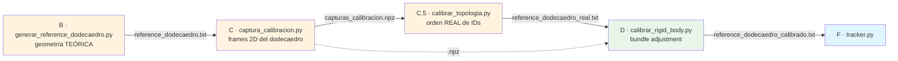

# 03 — Comandos de consola: pipeline B → D (antes de `tracker.py`)

**Audiencia**: operador del sistema MIRAI en demo o sesión nueva.
**Propósito**: cheatsheet de los 4 comandos que se ejecutan en consola **antes** de levantar `tracker.py`, con todos los flags configurables y sus valores típicos. Cubre desde la geometría teórica del dodecaedro hasta el rigid body calibrado.

> Para Etapa A (calibración intrínseca de cámara, externa con MRPT) ver `01_mapa_del_flujo.md §4 — Etapa A`.
> Para Etapa E (calibración de pivote, `test_pivote.py`) ver `05_reproducir_desde_cero.md §3.6`.
> Para Etapas F+ (tracker + Slicer) ver `06_workflow_slicer.md`.

---

## 0. Visión general del flujo B → D



**Tiempo total típico**: 60 s captura + ~11 min BA + segundos para los otros dos = **~15 min de cómputo** (más tiempo físico de rotar el dodecaedro).

**Pre-requisitos**:
- Venv activo: `cd C:\Dev\Dr.Milton\PoyectoNavegacion\codigo` → `.\.venv\Scripts\activate`.
- `data/camera_calibration_caja_luz.yml` existe (Etapa A).
- `tracker_config.yaml` apunta al diccionario correcto (`DICT_ARUCO_MIP_36h12`) y al `geometry_file` esperado.
- Dodecaedro físicamente armado con los markers pegados.

---

## 1. Resumen ejecutivo (los 4 comandos en orden)

Iter actual (IDs 151–161, edge 20 mm, marker 16 mm):

```powershell
# Etapa B — geometría teórica (segundos)
python generar_reference_dodecaedro.py

# Etapa C — captura del dataset (60 s rotando el dodecaedro)
python captura_calibracion.py --duracion 60

# Etapa C.5 — detección de topología real (segundos)
python calibrar_topologia.py

# Etapa D — bundle adjustment (~11 min)
python calibrar_rigid_body.py --teorico data/reference_dodecaedro_real.txt --max-frames 500 --max-nfev 3000
```

Para un dodecaedro nuevo (otros IDs/medidas), todo se ajusta por flags CLI (sin tocar código). Ver §6.

---

## 2. Etapa B — `generar_reference_dodecaedro.py`

**Qué hace**: calcula la geometría 3D **teórica** del dodecaedro regular pentagonal a partir de las fórmulas canónicas. Es la semilla del BA. **No usa cámara**, no abre ventanas, termina en <1 s.

### Comando typical (iter actual)

```powershell
python generar_reference_dodecaedro.py
```

### Flags disponibles

| Flag | Default | Significado |
|---|---|---|
| `--output` | `data/reference_dodecaedro.txt` | Ruta del archivo de salida |
| `--edge-mm` | `20.0` | Arista pentagonal del dodecaedro en mm |
| `--marker-mm` | `16.0` | Lado del marker ArUco impreso |
| `--id-top` | `151` | ID del marker en la cara TOP |
| `--ids-superior` | `152,153,154,155,156` | 5 IDs del anillo superior, orden CCW visto desde arriba |
| `--ids-inferior` | `157,158,159,160,161` | 5 IDs del anillo inferior, orden CCW |
| `--no-validate` | (off) | Salta los 11 chequeos de validación (NO usar en producción) |

### Salida esperada

```
Generando geometria teorica del dodecaedro...
  edge=20.0 mm, marker=16.0 mm
  id_top=151, ids_sup=[152, 153, 154, 155, 156], ids_inf=[157, 158, 159, 160, 161]
==============================================================================
VALIDACION GEOMETRICA EXHAUSTIVA
==============================================================================
  [PASS] PHI identidad ...
  [PASS] THETA = pi - dihedral ...
  [PASS] inradius formulas alternativas coinciden ...
  ... (11 chequeos en total) ...
RESULTADO: TODOS PASS

Archivo generado: data/reference_dodecaedro.txt
Total marcadores: 11
```

### Criterio de éxito

- Los 11 `[PASS]` aparecen.
- `RESULTADO: TODOS PASS` al final.
- Archivo `data/reference_dodecaedro.txt` existe (~2 KB).

### Configuraciones útiles

```powershell
# Dodecaedro nuevo con IDs 1-11, edge 25 mm, marker 20 mm:
python generar_reference_dodecaedro.py `
    --id-top 1 --ids-superior 2,3,4,5,6 --ids-inferior 7,8,9,10,11 `
    --edge-mm 25 --marker-mm 20 `
    --output data/reference_dodecaedro_iter2.txt
```

---

## 3. Etapa C — `captura_calibracion.py`

**Qué hace**: abre la cámara, detecta los markers del dodecaedro durante N segundos, guarda los corners 2D de cada frame con ≥2 markers detectados. Es la materia prima del BA. **Sí abre ventana** con preview.

### Comando típico

```powershell
python captura_calibracion.py --duracion 60
```

### Flags disponibles

| Flag | Default | Significado |
|---|---|---|
| `--config` | `tracker_config.yaml` | Config de cámara y diccionario |
| `--duracion` | `60` | Segundos de captura |
| `--output` | `capturas_calibracion.npz` | Archivo de salida |
| `--min-markers-per-frame` | `2` | Frames con menos markers detectados se descartan |
| `--warning-threshold` | `100` | Avisa si terminó con menos frames útiles |
| `--min-frames-per-marker` | `50` | Avisa si algún marker tiene pocas observaciones |
| `--camera-fail-timeout` | `30` | Aborta si la cámara no entrega frames en N s |
| `--geometry-file` | `data/reference_dodecaedro.txt` | Override: de dónde leer los IDs esperados |

### Salida esperada

- Preview en vivo con cuadrados verdes sobre los markers detectados.
- Contador en consola del estilo `Frames capturados: 1245 / 1800 detectados / 60s`.
- Al final: tabla por ID con #observaciones y un resumen `OK: X frames útiles guardados`.
- Archivo `capturas_calibracion.npz` (~5-20 MB según duración).

### Criterio de éxito

- ≥100 frames útiles (idealmente 1000-2500 en 60 s).
- Cada marker observado ≥50 veces.
- No aparece `WARNING: pocos frames`.

### Configuraciones útiles

```powershell
# Captura más larga para mejor cobertura:
python captura_calibracion.py --duracion 120

# Más estricto (sólo frames con ≥3 markers):
python captura_calibracion.py --duracion 60 --min-markers-per-frame 3

# Usar geometría custom (otro dodecaedro):
python captura_calibracion.py --duracion 60 --geometry-file data/reference_dodecaedro_iter2.txt
```

### Tips de captura física

- Distancia cámara-dodecaedro: **30-50 cm**.
- Rotación **lenta y suave** cubriendo todas las caras.
- Iluminación uniforme de la caja de luz.
- Evitar reflejos sobre los markers.

---

## 4. Etapa C.5 — `calibrar_topologia.py`

**Qué hace**: detecta el orden físico **real** de los IDs en los anillos del dodecaedro a partir de las distancias inter-marker. Sirve como "guard" antes del BA por si los markers se pegaron rotados respecto a la convención teórica. **Recomendado.**

### Comando típico

```powershell
python calibrar_topologia.py
```

### Flags disponibles

| Flag | Default | Significado |
|---|---|---|
| `--input` | `capturas_calibracion.npz` | Dataset de la Etapa C |
| `--output` | `data/reference_dodecaedro_real.txt` | Geometría teórica con IDs en orden real |
| `--id-top` | `151` | ID que está en la cara TOP |
| `--edge-mm` | `20.0` | Arista esperada del pentagonal |
| `--marker-mm` | `16.0` | Lado del marker |
| `--tol-adj-mm` | `5.0` | Tolerancia para clasificar dos markers como adyacentes |

### Salida esperada

- Grafo de adyacencias por par.
- Detección del TOP (5 vecinos), anillo superior y anillo inferior.
- Listado del orden cíclico detectado por anillo.
- Validación de distancias inter-marker vs `edge_mm` (debe matchear dentro de 3 mm).
- Archivo `data/reference_dodecaedro_real.txt` generado.

### Criterio de éxito

- Detectó **1 nodo TOP + 5 superior + 5 inferior** = 11 markers.
- Todas las distancias inter-marker dentro de **3 mm** del `edge_mm`.
- Mensaje final: `Topologia OK, guardado en ...`.

### Caso real del proyecto (memoria, 2026-05-19)

Detectó anillo inferior rotado: `[158, 159, 160, 161, 157]` (vs default `[157, 158, 159, 160, 161]`). Sin C.5, el BA habría partido de una semilla rotada y aunque converge igual, queda con gauge ambiguity más grande. **Por eso C.5 es recomendada aunque opcional.**

### Configuraciones útiles

```powershell
# Dodecaedro nuevo:
python calibrar_topologia.py --id-top 1 --edge-mm 25 --marker-mm 20

# Tolerancia más laxa (si la impresión 3D quedó imprecisa):
python calibrar_topologia.py --tol-adj-mm 8.0
```

---

## 5. Etapa D — `calibrar_rigid_body.py`

**Qué hace**: bundle adjustment. Resuelve simultáneamente (a) la pose 3D rígida de cada marker en el frame del dodecaedro (6 DOF) y (b) la pose del dodecaedro en cada frame. Minimiza el error de reproyección 2D global. Tamaño del marker queda fijo. **Esto es lo que da `reference_dodecaedro_calibrado.txt`, el archivo que va al tracker.**

### Comando típico

```powershell
python calibrar_rigid_body.py --teorico data/reference_dodecaedro_real.txt --max-frames 500 --max-nfev 3000
```

### Flags disponibles

| Flag | Default | Significado |
|---|---|---|
| `--input` | `capturas_calibracion.npz` | Dataset de Etapa C |
| `--teorico` | `data/reference_dodecaedro.txt` | Semilla del BA. **Usar `..._real.txt` si C.5 se corrió.** |
| `--output` | `data/reference_dodecaedro_calibrado.txt` | Geometría calibrada (la que carga el tracker) |
| `--ancla` | `151` | ID del marker anclado (gauge fix: define el origen). Cambiar si `id_top` distinto. |
| `--marker-mm` | `16.0` | Lado del marker (queda fijo en el BA) |
| `--huber-f-scale` | `2.0` | Robustez del loss Huber. Baja → más estricto |
| `--max-nfev` | `200` | Iteraciones máximas. **Iter actual: 3000 para 500 frames.** |
| `--min-frames-validos` | `50` | Mínimo de frames para considerar el dataset válido |
| `--max-frames` | `0` (=todos) | Submuestrear a N frames. Iter 1 usaba 500. |
| `--use-sparse` | (off) | **NO USAR**: bug pendiente (#22 en memory). Default denso converge bien. |
| `--x-scale-jac` | (off) | Experimental, interactúa mal con huber. Dejar off. |
| `--loss` | `huber` | Loss function. `huber` es robusto a outliers. |
| `--method` | `trf` | Método de least-squares. `trf` o `dogbox`. |
| `--verbose` | `2` | `2` = iter por iter (recomendado, sino el script se queda mudo) |

### Salida esperada

- Carga de `npz` + teórico.
- Tabla "Iteración por iteración" del optimizer (gracias a `verbose=2`):
  ```
     Iteration     Total nfev        Cost      Cost reduction    Step norm     Optimality
         0              1         1.4771e+04                                    9.30e+02
         1            165         1.1234e+04    3.54e+03       1.23e+00         5.67e+02
         ...
  ```
- Resumen final con `RMSE final`, `status`, métricas de consistencia inter-marker, análisis Procrustes.
- Archivo `reference_dodecaedro_calibrado.txt` generado con `fsync` y validación de tokens (mitigación de truncación OneDrive).

### Criterio de éxito

| Métrica | Objetivo |
|---|---|
| RMSE reproyección final | **≤1 px** (iter 2: 0.45 px) |
| `status` | `2` (`ftol` reached) o `3` (`xtol` reached) |
| Distancias inter-marker (mean diff vs teórico) | `<1 mm` |
| Distancias inter-marker (max diff) | `<2 mm` |
| Procrustes RMS (teo → cal) | `<1.5 mm` |

**Nota sobre gauge ambiguity**: el script puede reportar "desplazamiento por marker" grande (decenas de mm). **Esto no es error** mientras las distancias inter-marker y Procrustes pasen. Ver `01_mapa_del_flujo.md §6.2`.

### Configuraciones útiles

```powershell
# Iter actual (recomendado):
python calibrar_rigid_body.py --teorico data/reference_dodecaedro_real.txt --max-frames 500 --max-nfev 3000

# Rápido sin C.5 (acepta gauge ambiguity rotacional mayor):
python calibrar_rigid_body.py --max-frames 150 --max-nfev 500

# Dodecaedro nuevo con IDs 1-11:
python calibrar_rigid_body.py `
    --teorico data/reference_dodecaedro_real.txt `
    --ancla 1 --marker-mm 20 `
    --max-frames 500 --max-nfev 3000
```

---

## 6. Matriz de configuración para dodecaedro nuevo

Si cambia el dodecaedro (IDs, dimensiones, diccionario), estos son los puntos a tocar — **sin modificar código**:

| Cambio | Dónde se ajusta |
|---|---|
| **IDs del dodecaedro** | Flags `--id-top`, `--ids-superior`, `--ids-inferior` en B; `--id-top` en C.5; `--ancla` en D |
| **edge_mm** | Flag `--edge-mm` en B y C.5 |
| **marker_mm** | Flag `--marker-mm` en B, C.5 y D |
| **Diccionario ArUco** | `tracker_config.yaml: markers.dictionary` (lo usan C, C.5 indirectamente) |
| **ID del marker del paciente** | `tracker_config.yaml: markers.list[0].id` y `.size_mm` |
| **Más/menos frames mínimos** | `--min-markers-per-frame` en C; `--min-frames-validos` en D |
| **Duración de captura** | `--duracion` en C |
| **Geometría file output** | `--output` en B/C.5/D |

---

## 7. Troubleshooting rápido

| Síntoma | Etapa | Acción |
|---|---|---|
| `Fatal error in launcher: Unable to create process` | cualquiera | Usar `python -m <script>` o recrear venv |
| `[FAIL] Marker cabe en cara` | B | `--marker-mm` muy grande para `--edge-mm`. Reducir o aumentar |
| Cámara no abre o cae a 5 FPS | C | Verificar backend MSMF + fourcc MJPG en `tracker_config.yaml` |
| <100 frames útiles | C | Aumentar `--duracion`, mejorar iluminación, bajar `--min-markers-per-frame` a 2 |
| C.5 reporta distancias fuera de tolerancia | C.5 | Subir `--tol-adj-mm` o revisar pegado físico de markers |
| BA no converge (`status -1`) o RMSE alto | D | Verificar que `--teorico` es el correcto; aumentar `--max-nfev`; bajar `--max-frames` para test rápido |
| BA reporta desplazamiento grande pero RMSE bajo | D | Es gauge ambiguity (normal). Validar con Procrustes y distancias inter-marker |
| `IOError` al guardar calibrado | D | Filesystem inestable (OneDrive). Re-correr — la validación tokens+fsync lo detecta |

---

## 8. Después de D

Una vez que `reference_dodecaedro_calibrado.txt` existe y validó las métricas:

- **Etapa E** (`test_pivote.py`) — calibración del offset de la punta del stylus. Una vez por ensamblaje del stylus. Ver `05_reproducir_desde_cero.md §3.6`.
- **Etapa F** (`tracker.py --config tracker_config.yaml`) — tracking en vivo. Inicia OpenIGTLink en :18944.
- **Etapas G+H+I** en 3D Slicer. Ver `06_workflow_slicer.md`.

---

## 9. Referencias cruzadas

- `01_mapa_del_flujo.md` — pipeline completo end-to-end con todos los detalles por etapa.
- `02_contratos_pipeline.png` — contratos de entrada/salida visualizados.
- `05_reproducir_desde_cero.md` — guía de replicación con checklist.
- `06_workflow_slicer.md` — todo lo que pasa después del tracker en 3D Slicer.
