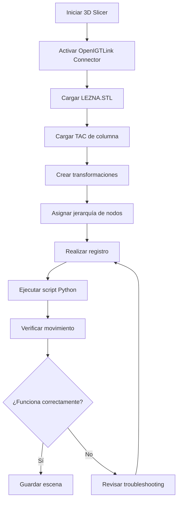

# Guía de Configuración de 3D Slicer para Navegación Quirúrgica

Esta guía explica cómo configurar correctamente 3D Slicer para recibir datos de navegación del sistema de ArUcos y visualizar la lezna en relación con el TAC de la columna vertebral.

## Tabla de Contenidos

1. [Requisitos Previos](#requisitos-previos)
2. [Configuración de OpenIGTLink](#configuración-de-openigtlink)
3. [Jerarquía de Transformaciones](#jerarquía-de-transformaciones)
4. [Carga del Modelo TAC](#carga-del-modelo-tac)
5. [Registro (Alineación)](#registro-alineación)
6. [Verificación del Sistema](#verificación-del-sistema)

---

## Requisitos Previos

### Software Necesario

- **3D Slicer** versión 5.0 o superior
- Extensión **SlicerIGT** instalada

### Instalación de SlicerIGT

1. Abrir 3D Slicer
2. Ir a: `View` → `Extension Manager`
3. Buscar: `SlicerIGT`
4. Hacer clic en `Install`
5. Reiniciar Slicer cuando se solicite

### Archivos Necesarios

- `LEZNA.STL` - Modelo 3D de la lezna quirúrgica
- `columna.nrrd` o `columna.nii` - TAC de la columna vertebral
- Script Python ejecutándose: `aruco_navegacion_relativa.py`

---

## Configuración de OpenIGTLink

### Paso 1: Crear Conector OpenIGTLink

1. Ir al módulo: `Modules` → `IGT` → `OpenIGTLink IF`

2. En la sección **Connectors**, hacer clic en el botón `+` (Add Connector)

3. Configurar el conector:
   - **Name**: `PythonConnector`
   - **Type**: `Server`
   - **Port**: `18944` (puerto por defecto)
   - **Active**: ✅ Marcar checkbox

4. Hacer clic en `Apply`

> [!IMPORTANT]
> El conector debe estar en modo **Server** y el puerto debe coincidir con el configurado en el script Python (`IGTL_PORT = 18944`).

### Paso 2: Verificar Conexión

Cuando ejecutes el script Python `aruco_navegacion_relativa.py`, deberías ver:

- En **Python**: `✅ Conectado con 3D Slicer`
- En **Slicer** (pestaña I/O): Un nuevo nodo llamado `LeznaToColumna` aparecerá automáticamente

---

## Jerarquía de Transformaciones

La jerarquía correcta de transformaciones es fundamental para que la navegación funcione correctamente.

### Estructura de Nodos

```
Escena de Slicer
│
├── ArUco_Columna (Transform)
│   └── Modelo_Columna (Model - TAC)
│
└── LeznaToColumna (Transform - recibido de Python)
    └── Modelo_Lezna (Model - LEZNA.STL)
```

### Paso 1: Crear Transformación de la Columna

1. Ir al módulo: `Modules` → `Transforms`

2. Hacer clic en el botón `Create new Transform`

3. Renombrar a: `ArUco_Columna`

### Paso 2: Cargar Modelo de la Lezna

1. Ir a: `File` → `Add Data`

2. Seleccionar el archivo `LEZNA.STL`

3. Hacer clic en `OK`

4. El modelo aparecerá en la vista 3D

### Paso 3: Asignar Transformaciones

1. Ir al módulo: `Modules` → `Transforms`

2. En la sección **Apply Transform**:
   
   a. Seleccionar `LeznaToColumna` en el dropdown superior
   
   b. En la lista de nodos, buscar y seleccionar `LEZNA.STL`
   
   c. Hacer clic en la flecha `→` para mover el modelo bajo la transformación

3. El modelo de la lezna ahora se moverá según los datos recibidos de Python

> [!TIP]
> Puedes verificar la jerarquía en el módulo `Data` (Modules → Core → Data). Deberías ver `LEZNA.STL` indentado bajo `LeznaToColumna`.

---

## Carga del Modelo TAC

### Opción A: Cargar Volumen DICOM

1. Ir a: `File` → `Add DICOM Data`

2. Hacer clic en `Import DICOM files`

3. Seleccionar la carpeta con los archivos DICOM del TAC

4. Hacer clic en `Import`

5. Seleccionar el estudio y hacer clic en `Load`

### Opción B: Cargar Archivo NRRD/NII

1. Ir a: `File` → `Add Data`

2. Seleccionar el archivo `columna.nrrd` o `columna.nii`

3. Hacer clic en `OK`

### Asignar Transformación al TAC

1. Ir al módulo: `Modules` → `Transforms`

2. Seleccionar `ArUco_Columna` en el dropdown

3. En la lista de nodos, seleccionar el volumen del TAC

4. Hacer clic en la flecha `→`

5. El TAC ahora está bajo la transformación `ArUco_Columna`

---

## Registro (Alineación)

El **registro** es el proceso de alinear el TAC virtual con el mundo físico. Esto se hace alineando el marcador ArUco virtual con el marcador ArUco físico colocado en la columna.

### Método 1: Registro Manual (Rápido)

1. Colocar el marcador ArUco físico (ID 0) en una posición conocida de la columna física

2. En Slicer, ir al módulo: `Modules` → `Transforms`

3. Seleccionar `ArUco_Columna`

4. Usar los sliders de **Translation** y **Rotation** para mover el TAC hasta que coincida visualmente con la posición del marcador físico

5. Una vez alineado, hacer clic en `Harden Transform` para fijar la transformación

> [!WARNING]
> El registro manual es menos preciso. Para aplicaciones quirúrgicas reales, usa el método de registro por puntos fiduciales.

### Método 2: Registro por Puntos Fiduciales (Preciso)

Este método usa puntos anatómicos conocidos para alinear el TAC con el mundo real.

#### Paso 1: Preparación Física

1. Colocar el marcador ArUco (ID 0) en la columna física

2. Identificar 3-5 puntos anatómicos fácilmente reconocibles (ej: apófisis espinosas, bordes vertebrales)

3. Medir la posición de estos puntos respecto al marcador ArUco usando un calibrador o puntero

#### Paso 2: Crear Puntos Fiduciales en Slicer

1. Ir al módulo: `Modules` → `IGT` → `Fiducial Registration Wizard`

2. En la sección **From fiducials**:
   - Hacer clic en `Create new MarkupsFiducial` → Renombrar a `Puntos_Fisicos`

3. En la sección **To fiducials**:
   - Hacer clic en `Create new MarkupsFiducial` → Renombrar a `Puntos_TAC`

#### Paso 3: Marcar Puntos en el TAC

1. Ir al módulo: `Modules` → `Core` → `Markups`

2. Seleccionar `Puntos_TAC` en el dropdown

3. Hacer clic en `Place Markup` (icono de punto)

4. En las vistas 2D (Axial, Sagital, Coronal), hacer clic en los puntos anatómicos identificados

5. Repetir para todos los puntos (mínimo 3, recomendado 5)

#### Paso 4: Ingresar Coordenadas Físicas

1. Volver al módulo `Fiducial Registration Wizard`

2. Seleccionar `Puntos_Fisicos`

3. Para cada punto, hacer clic en `Add Markup` e ingresar las coordenadas medidas físicamente (en mm)

#### Paso 5: Calcular Registro

1. En la sección **Transform**:
   - Seleccionar `ArUco_Columna`

2. Hacer clic en `Update`

3. Verificar el **Registration Error** (debe ser < 3 mm para navegación quirúrgica)

4. Si el error es aceptable, hacer clic en `Harden Transform`

> [!IMPORTANT]
> El error de registro debe ser menor a 3 mm para aplicaciones quirúrgicas. Si es mayor, revisa las mediciones físicas y los puntos marcados en el TAC.

---

## Verificación del Sistema

### Checklist de Verificación

- [ ] **OpenIGTLink Connector** está activo y conectado
- [ ] El nodo `LeznaToColumna` aparece en la escena cuando se ejecuta el script Python
- [ ] El modelo `LEZNA.STL` está cargado y bajo la transformación `LeznaToColumna`
- [ ] El TAC de la columna está cargado y bajo la transformación `ArUco_Columna`
- [ ] El registro está completado con error < 3 mm
- [ ] Al mover la lezna física, el modelo en Slicer se mueve en tiempo real

### Prueba de Movimiento

1. Ejecutar el script Python: `python aruco_navegacion_relativa.py`

2. Colocar ambos marcadores ArUco (ID 0 y ID 1) frente a las cámaras

3. Mover la lezna física (ArUco ID 1) lentamente

4. Verificar que el modelo `LEZNA.STL` en Slicer se mueve suavemente

5. Verificar que la posición relativa es correcta (si mueves la lezna 5 cm a la derecha, en Slicer debe moverse 5 cm a la derecha)

### Solución de Problemas

| Problema | Solución |
|----------|----------|
| No aparece el nodo `LeznaToColumna` | Verificar que el conector OpenIGTLink esté activo y en modo Server |
| La lezna no se mueve | Verificar que `LEZNA.STL` esté bajo la transformación `LeznaToColumna` |
| La lezna se mueve pero con escala incorrecta | Ejecutar `calibracion_escala.py` para calibrar el factor de escala |
| La lezna "salta" o tiembla | Verificar que ambos ArUcos sean detectados simultáneamente |
| El TAC no está alineado | Repetir el proceso de registro con más puntos fiduciales |

---

## Configuración Avanzada

### Ajustar Visualización

1. **Opacidad del TAC**:
   - Ir a `Modules` → `Volume Rendering`
   - Ajustar la opacidad para ver la lezna dentro del TAC

2. **Color de la Lezna**:
   - Ir a `Modules` → `Models`
   - Seleccionar `LEZNA.STL`
   - Cambiar color en la sección `Display`

3. **Vistas Personalizadas**:
   - Usar el módulo `View Controllers` para configurar vistas oblicuas
   - Útil para seguir la trayectoria de la lezna

### Guardar Escena

Para no tener que reconfigurar cada vez:

1. Ir a: `File` → `Save`

2. Marcar:
   - ✅ Scene
   - ✅ Transforms
   - ✅ Models

3. Hacer clic en `Save`

4. La próxima vez, simplemente cargar la escena: `File` → `Add Data` → Seleccionar archivo `.mrml`

---

## Resumen de Flujo de Trabajo



---

## Próximos Pasos

Una vez que el sistema esté funcionando correctamente:

1. **Calibrar la escala** con `calibracion_escala.py`
2. **Realizar pruebas de precisión** (medir distancias conocidas)
3. **Optimizar el filtro de suavizado** (ajustar `ALPHA_FILTER` en el script)
4. **Practicar el registro** hasta lograr errores < 2 mm

> [!TIP]
> Guarda múltiples escenas con diferentes configuraciones de visualización para diferentes tipos de procedimientos.
